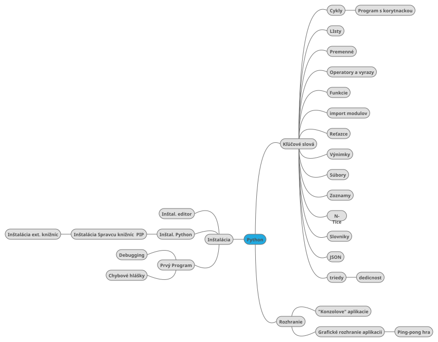

## Stránka je venovaná predmetu Didaktika informatiky 3

Slúži ako uložisko pre prílohy potrebné pre splnenie skúšky z tohto predmetu.


## Programovanie v jazyku Python

Ako voliteľnú tému som si vybral, programovací jazyk Python. Pomocou ktorého chcem vyučovať žiakov 4 ročníka na stredných odorných školách objektové programovanie.

```python
print "Hello World!"
print "Hello Again"
print "I like typing this."
print "This is fun."
print 'Yay! Printing.'
print "I'd much rather you 'not'."
print 'I "said" do not touch this.'

```

### Metodické listy

* [Metodický list Č.1](files/metodicky_list_python_01.pdf).
* [Metodický list Č.2](files/metodicky_list_python_02.pdf).
* [Metodický list Č.3](files/metodicky_list_python_03.pdf).

### Tématický plán

[Tématický plán](files/Matkulcik-tematický-plán.pdf).

### Testy
* [Test Č.1](files/Matkulcik_Test.pdf).
* [Test Č.2](files/Matkulcik_Test_02.pdf).

### Pracovné listy
* [Pracovný list Č.1](files/Matkulcik_pracovny_list.pdf).
* [Pracovný list Č.2](files/Matkulcik_pracovny_list_2.pdf).

### Návrh projektu k metodike
[Návrh projektu](files/projekt_didaktika_Matkulcik.pdf).

### Myšlienková mapa pojmov



### Recenzia

[Recenzia](files/Matkullcik_recenzia.pdf)

### Užitočné odkazy

[Syntax programovacích jazykov](https://syntaxdb.com/)

[Python cheatsheet](https://www.pythonsheets.com/)

[Python online solutions](http://code.runnable.com/?filter=Python&page=3&orderBy=popular)

[KNIHA: ponorme sa do pythonu](http://knihy.nic.cz/files/edice/python_3.pdf)

[Learn Python](http://learnpython.org/)

[Python tips & traps](https://www.airpair.com/python/posts/python-tips-and-traps)

[prvni jazyk python](http://macek.sandbox.cz/texty/prvni-jazyk-python/)

[Hosting pre Python aplikácie](https://rosti.cz/)
